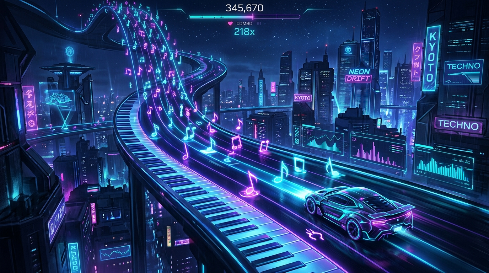

<div align="center">
  

  <br><br>

  

  <p align="center" style="font-size: 16px; color: #888;">
    Engineered for absolute precision. Designed with minimalist aesthetics.
  </p>

  <br>

  <a href="#-why-keystream">Philosophy</a> &nbsp;•&nbsp;
  <a href="#-core-features">Features</a> &nbsp;•&nbsp;
  <a href="#-setup--deployment">Deployment</a>

  <br><br>

  
</div>

<br>

---

## ✦ Why KeyStream?

Most web-based rhythm games suffer from a fatal flaw: **Garbage Collection (GC) Stutters**. When you're playing a high-density 4K map, a single dropped frame ruins a perfect combo. 

KeyStream was born to solve this. Utilizing a custom **Zero-GC Canvas Engine**, the game pre-allocates memory, uses `O(1)` swap-and-pop particle algorithms, and runs purely in Vanilla JS without heavy frameworks blocking the main thread. The result? A locked **144+ FPS** experience.

---

## ✦ Core Features

<table align="center" width="100%" style="border-collapse: collapse; border: none;">
  <tr style="border: none;">
    <td width="50%" valign="top" style="border: none; padding: 20px;">
      <h3>🎵 Native <code>.osz</code> Parsing</h3>
      <p style="color:#a1a1aa; font-size:14px;">Your library is ready. Drag and drop any <i>osu!mania</i> beatmap archive directly into the browser. The engine extracts, parses, and plays instantly. No server conversion required.</p>
    </td>
    <td width="50%" valign="top" style="border: none; padding: 20px;">
      <h3>⚡ Flawless Performance</h3>
      <p style="color:#a1a1aa; font-size:14px;">Experience ultra-low latency inputs and butter-smooth scrolling. Pre-bound rendering closures ensure the engine never stops to clean up memory mid-song.</p>
    </td>
  </tr>
  <tr style="border: none;">
    <td width="50%" valign="top" style="border: none; padding: 20px;">
      <h3>🌍 Global Leaderboards</h3>
      <p style="color:#a1a1aa; font-size:14px;">Powered by Firebase. Login securely with Google, submit your scores, rank up your profile, and compete for the #1 spot on the worldwide ranking matrix.</p>
    </td>
    <td width="50%" valign="top" style="border: none; padding: 20px;">
      <h3>🎨 Midnight Tech UX</h3>
      <p style="color:#a1a1aa; font-size:14px;">A beautifully crafted dark-mode interface designed using world-class <b>UX/UI Master</b> guidelines. Deep ocean blacks, electric indigo accents, and ultimate clarity.</p>
    </td>
  </tr>
</table>

---

## ✦ Setup & Deployment

<details>
<summary><b>🕹️ 1. Boot the Game Server</b></summary>
<br>

To unleash the full potential of KeyStream locally (required for local beatmap parsing via ES6 modules):

```bash
# Clone the repository
git clone https://github.com/masuzu2/mania_game.git
cd mania_game

# Boot the high-performance local server
node server.js
```
Open **`http://localhost:8000`** in your browser.

</details>

<details>
<summary><b>🔐 2. Enable Global Leaderboards (Firebase)</b></summary>
<br>

To enable the competitive leaderboard matrix:
1. Inject your web client configuration into `js/auth.js` (`FIREBASE_CONFIG`).
2. Generate a **Service Account Key** from your Firebase Console.
3. Save it as `serviceAccountKey.json` in the root directory. *(Secured by `.gitignore`)*.

</details>

---

<div align="center">
  <br>
  <h3>❝ Design is not just what it looks like. Design is how it works. ❞</h3>
  <p style="color: #666; font-size: 13px;">Built with absolute passion for the rhythm game community.</p>
  <br>
</div>
